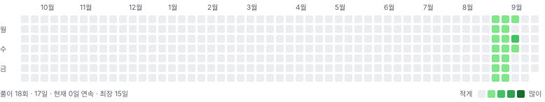

# Programmers

프로그래머스에서 푼 문제를 모아두는 곳.

거창한 목표가 있는 건 아니다. 그냥 머리가 굳는 게 싫어서 시작했다. 하루에 한 문제라도.

## 랜덤 추천 문제

<!-- DAILY:START -->
> **2026-08-23** · 아직 안 푼 295문제 중에서 뽑았다.

1. **[크기가 작은 부분 문자열 ](https://school.programmers.co.kr/learn/courses/30/lessons/147355)** · Lv.1 · 정답률 79%
2. **[기지국 설치](https://school.programmers.co.kr/learn/courses/30/lessons/12979)** · Lv.3 · 정답률 59%
3. **[이모티콘 할인행사](https://school.programmers.co.kr/learn/courses/30/lessons/150368)** · Lv.2 · 정답률 45%

매일 자정에 새로 뽑힌다.
<!-- DAILY:END -->

## 연속 학습

<picture>
  <source media="(prefers-color-scheme: dark)" srcset="assets/grass-dark.svg">
  
</picture>

<!-- STREAK:START -->
`아직 기록 없음` — 첫 풀이가 올라오면 여기부터 채워진다.
<!-- STREAK:END -->

README를 고치거나 설정을 만지는 커밋은 세지 않는다. <code>프로그래머스/</code> 아래에 풀이가 실제로 올라온 날만 칸이 채워진다.

## 풀이 목록

<!-- INDEX:START -->
> 아직 올라온 풀이가 없다. 문제를 하나 풀면 여기에 표가 생긴다.
<!-- INDEX:END -->

## 자동화

문제를 풀고 제출하면 [백준허브](https://github.com/BaekjoonHub/BaekjoonHub)가 코드를 이 저장소로 올린다.
그 뒤는 GitHub Actions가 알아서 한다.

| 스크립트 | 언제 도는지 | 하는 일 |
|---|---|---|
| `pick-daily.mjs` | 매일 자정, 수동 실행 | 아직 안 푼 문제 중에서 세 개를 뽑는다 |
| `render-grass.mjs` | 풀이가 올라올 때, 매일 자정 | 커밋 기록을 읽어 잔디를 다시 그린다 |
| `build-index.mjs` | 풀이가 올라올 때, 매일 자정 | 폴더를 훑어 위 목록을 다시 만든다 |

추천이 마음에 안 들면 Actions 탭에서 `daily` 워크플로를 `reroll`을 켜고 돌리면 새로 뽑힌다.
난이도 범위와 언어, 뽑는 개수는 [daily.yml](.github/workflows/daily.yml)의 `env`에서 바꾼다.

## 기록

### 2026-08-23

자동화부터 깔고 시작했다. 막상 앉으면 뭘 풀지 고르다가 시간을 다 버리는 게 싫었다. 이제 아침에 열면 오늘 풀 문제가 이미 정해져 있다.

---

저장소 구성과 자동화 아이디어는 <a href="https://github.com/pill27211/programmers-daily">pill27211/programmers-daily</a>를 참고했다.
